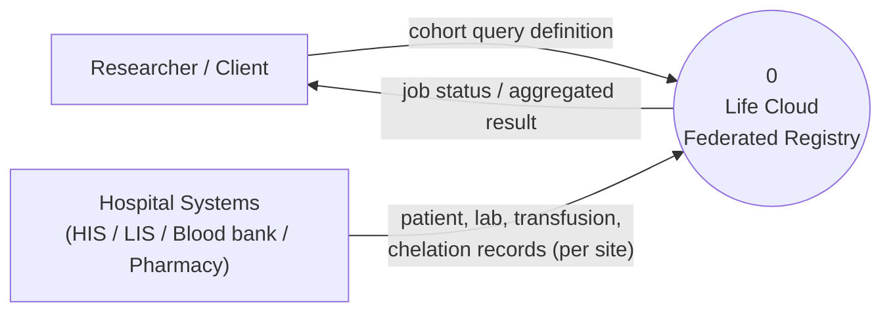
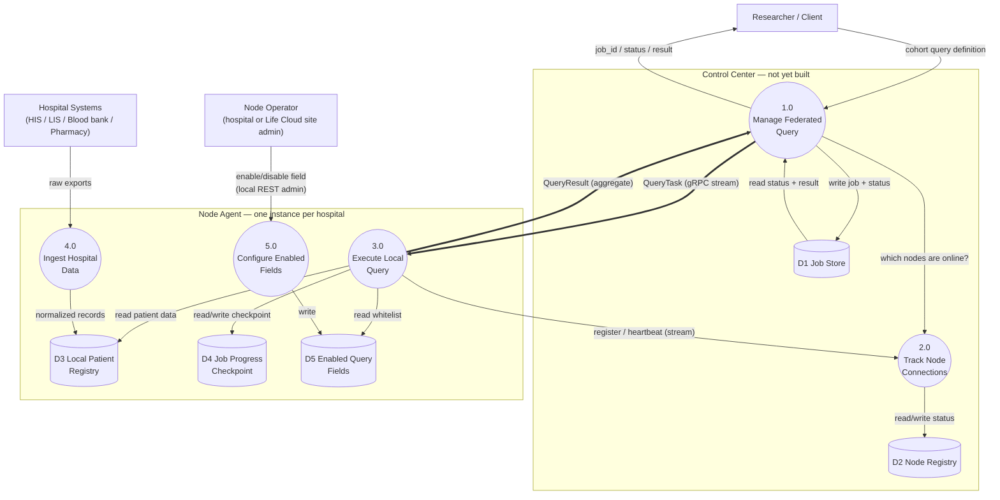
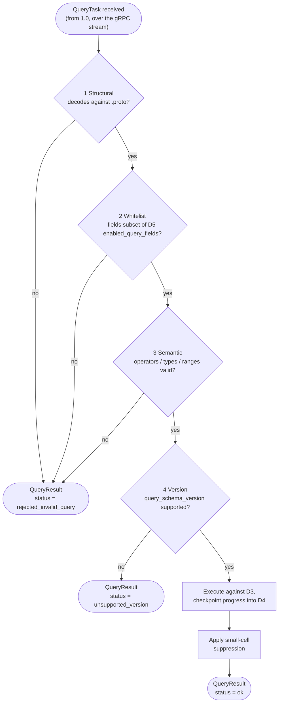
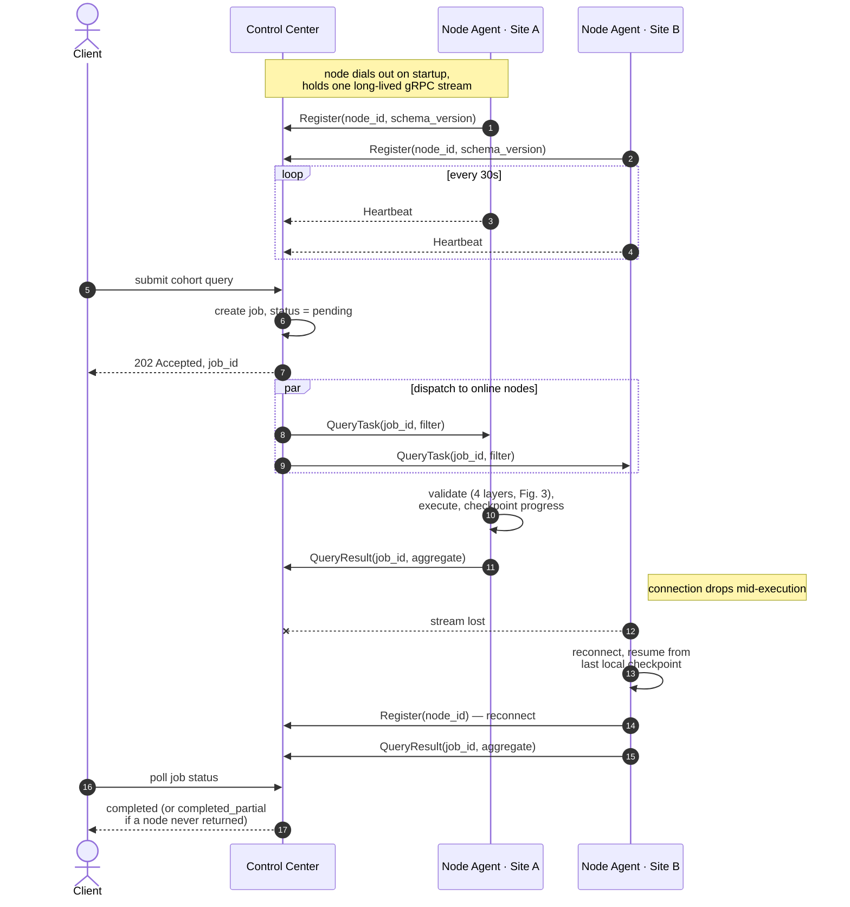
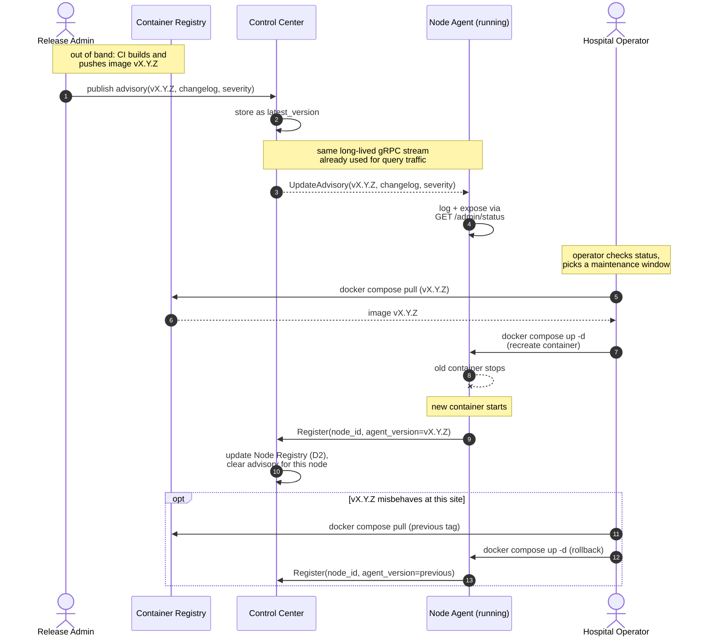
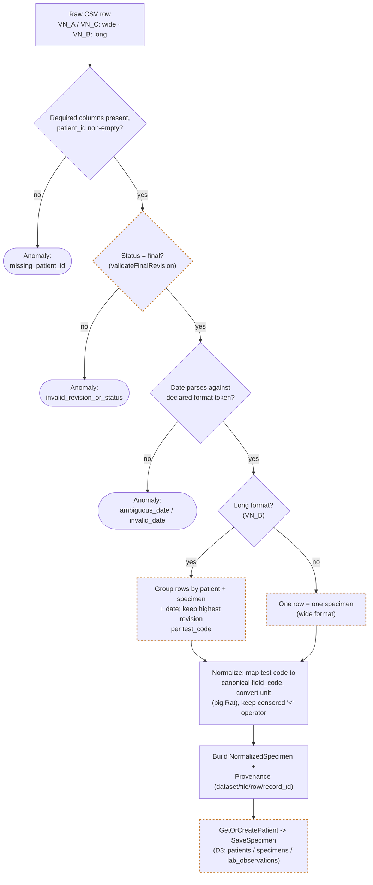

# Federated Query Flow

Data flow diagrams (level 0, 1 & 2), the async query sequence, the node
update/release flow, and the data flow dictionary for the Life Cloud node
agent and its (not-yet-built) control center. This is the reviewed shape
`docs/decisions/0001`–`0003` describe in prose; the normative wire contract
is decision 0004 (`.proto` implementation follows that decision).

Each hospital runs one node agent against its own local data; no
patient-level record ever leaves the node. A central control center (not
yet built) accepts cohort queries, fans them out to every online node over a
long-lived, node-initiated gRPC stream, and returns only the aggregated,
suppressed results.

## Notation

- **Process** (circle): transforms or routes data.
- **External entity** (rectangle): outside the system.
- **Data store** (cylinder): persisted locally.
- **`==>` thick arrow**: crosses the hospital ⇄ control center network
  boundary, over gRPC.

## Fig. 1 — DFD Level 0: system context



The whole system as one process. A client submits a cohort definition and
reads back a status or an aggregated result; it never receives
patient-level rows. Each hospital's own systems feed the system one-way —
nothing is written back into the hospital's source systems.

## Fig. 2 — DFD Level 1: process decomposition



Only `1.0` and `3.0` cross the hospital's network boundary (thick arrows),
carried by the single gRPC stream the node dials out on startup. `4.0`
ingests each hospital's own systems into the node's local store on a
completely separate path — it never touches the federated channel. `D4`
exists so a node that drops mid-query can resume from its last checkpoint
instead of rerunning the whole task. `D5`/`5.0` hold that specific
hospital's own data-sharing agreement — which fields it actually allows
queried — separate from the global schema Life Cloud defines (decision
0002); a local operator, not the control center, writes to it.

## Fig. 3 — DFD Level 2: inside 3.0, validate then execute



No step here waits on a person — decision 0002 chose automatic execution
once a task clears all four checks, so every guarantee the system makes has
to live in this pipeline and in suppression, not in a manual gate. A
rejection is always a specific status, sent back on the same stream, never
a query that silently ran partway or returned nothing.

## Fig. 4 — Sequence: one asynchronous federated query



Submission is fire-and-forget: the client gets a `job_id` immediately and
polls for the result, so one slow or unreachable hospital never blocks the
request. Site B's dropped stream shows the case decision 0002 exists for —
the node resumes from its own checkpoint on reconnect rather than redoing
the query, and the control center still closes the job (partially) instead
of hanging on a node that never comes back.

## Fig. 5 — Sequence: node update & release flow



The control center only advises — it never restarts a node itself. A new
version reaches a hospital exactly the way today's deployment already works
(`docker compose pull` + `up -d` from `docker-compose.yml`), so no
self-update logic is needed in the Go binary, and every node can sit on a
different version between advisory and applied update. Rollback reuses the
same two commands against the previous image tag — no bespoke rollback path
to maintain.

## Fig. 6 — DFD Level 2: inside 4.0, messy data to canonical form



The nodes with a dashed amber border are where `/code-review` found real gaps
(2026-09-17, tracked in the Phase 2 plan, not yet fixed): `STATUSCHECK`
compares status case-sensitively to `"final"`; `GROUP` picks only the first
row's collection date within a group and silently drops a same-revision
conflicting value instead of raising an anomaly; `ONEROW` never validates
that the wide-format specimen ID column is non-empty (unlike the long-format
path); `PERSIST` dedupes/upserts specimens by *file/row provenance*
(`source_dataset, source_file, source_record_id`), not by the hospital's own
specimen identifier that every adapter parses but discards — so a genuinely
corrected re-export (new filename or shifted row numbers for the same real
specimen) creates a duplicate specimen instead of updating it, and the
observation-level "latest revision wins" fix only compares *call order*, not
an actual revision number, across separate ingest runs.

Every anomaly carries `{source_file, source_row_number, reason}` and is
recorded, never used to silently drop, correct, or guess a value — matching
`life-cloud`'s own stated policy for messy source data. `wide.go` (VN_A,
VN_C) and `long.go` (VN_B) diverge only at grouping: a wide row is already
one specimen; a long file's rows must be grouped and revision-resolved
first. Both converge on the same normalization and persistence path.

## Data flow dictionary

The diagrams show shape; this is the content behind every box and arrow —
what each process, store, and flow actually is, down to the message shape
implied by Fig. 3.

### External entities

| Entity | Role |
|---|---|
| Researcher / Client | Submits a cohort query definition, polls for its status/result. Never connects to a node directly. |
| Hospital Systems | HIS / LIS / blood bank / pharmacy. One-way source into a node — the system never writes back into them. |
| Node Operator | Hospital IT, or the Life Cloud team managing that site. Only actor who can change `D5` or apply an update (Fig. 5). |
| Release Admin | Life Cloud staff who publish a new node-agent image and record it as available with the control center (Fig. 5). |

### Processes

| ID | Name | Runs in | Does |
|---|---|---|---|
| 0 | Life Cloud Federated Registry | — | The whole system, as seen from outside (Fig. 1). |
| 1.0 | Manage Federated Query | Control Center | Accepts submissions, creates/tracks jobs, dispatches, aggregates, serves status. |
| 2.0 | Track Node Connections | Control Center | Handles registration/heartbeat off the gRPC stream; maintains online/offline + version per node. |
| 3.0 | Execute Local Query | Node Agent | Validates and runs one `QueryTask`; decomposed in Fig. 3. |
| 3.1 | Validate Structure | Node Agent | Confirms the message decodes against the `.proto` contract. |
| 3.2 | Validate Whitelist | Node Agent | Every referenced field exists in this node's own `D5`. |
| 3.3 | Validate Semantic | Node Agent | Operators match field types; ranges and dates are well-formed. |
| 3.4 | Validate Version | Node Agent | Checks `query_schema_version` against what this build understands. |
| 3.5 | Execute Query | Node Agent | Runs the validated filter against `D3`, checkpointing into `D4`. |
| 3.6 | Apply Output Policy | Node Agent | Small-cell suppression before a result is allowed to leave the node. |
| 4.0 | Ingest Hospital Data | Node Agent | Extracts and normalizes hospital exports into `D3`. Separate path from the federated channel. |
| 5.0 | Configure Enabled Fields | Node Agent | Local REST admin over `D5`; the only writer of that store. |

### Data stores

| ID | Name | Owner | Holds |
|---|---|---|---|
| D1 | Job Store | Control Center | `job_id`, submitted filter, status, per-node results as they arrive. |
| D2 | Node Registry | Control Center | `node_id`, online/offline, last heartbeat, last-seen `agent_version`. |
| D3 | Local Patient Registry | Node Agent | This hospital's own canonical patient / lab / transfusion / chelation records. |
| D4 | Job Progress Checkpoint | Node Agent | `job_id`, last completed batch — so a dropped stream can resume, not rerun. |
| D5 | Enabled Query Fields | Node Agent | `field_code`, `enabled`, `updated_at`, `updated_by` — this hospital's actual data-sharing agreement, a subset of the global schema. |

### Flows — Fig. 1 (DFD 0)

| Flow | Carries |
|---|---|
| Researcher/Client → 0 | Cohort query definition — structured filter, never raw SQL. |
| 0 → Researcher/Client | `job_id`, then job status / aggregated result. Never patient-level rows. |
| Hospital Systems → 0 | Raw HIS/LIS/blood bank/pharmacy records, one hospital's own — one-way only. |

### Flows — Fig. 2 (DFD 1)

| Flow | Carries | Ref |
|---|---|---|
| Researcher → 1.0 | Cohort query definition. | 0002 |
| 1.0 → Researcher | `job_id` immediately; status/result on poll. | 0002 |
| 1.0 ↔ D1 | Write job + status; read status + result to serve a poll. | 0002 |
| 1.0 → 2.0 | Which nodes are online right now. | 0001 |
| 2.0 ↔ D2 | `node_id`, status, `agent_version`. | 0001 / 0003 |
| 1.0 ⇒ 3.0 | `QueryTask` — crosses the hospital network boundary, over the gRPC stream. | 0001 / 0002 |
| 3.0 ⇒ 1.0 | `QueryResult` — crosses back the same way. | 0001 / 0002 |
| 3.0 → 2.0 | Register / heartbeat on the same stream. | 0001 / 0003 |
| 3.0 → D3 | Reads patient data for a validated query. | 0002 |
| 3.0 ↔ D4 | Reads/writes checkpoint progress. | 0002 |
| 3.0 → D5 | Reads this node's enabled-field whitelist. | 0002 |
| Node Operator → 5.0 → D5 | Enable/disable one field, via local REST admin. | 0002 |
| Hospital Systems → 4.0 → D3 | Raw export in, normalized canonical record out. | — |

### Flows — Fig. 3 (DFD 2, inside 3.0)

| Step | Carries |
|---|---|
| 1.0 → 3.1 | `QueryTask` bytes off the stream. |
| 3.1 fail → result | `status = rejected_invalid_query`. |
| 3.2 reads D5, fail → result | `status = rejected_invalid_query`, reason names the field. |
| 3.3 fail → result | `status = rejected_invalid_query`, reason names the operator/range. |
| 3.4 fail → result | `status = unsupported_version`. |
| 3.5 reads/writes D3, D4 | Executes the validated filter; checkpoints as it goes. |
| 3.5 → 3.6 | Raw aggregate, pre-suppression. |
| 3.6 → 1.0 | `QueryResult`: `status = ok`, suppressed aggregate. |

Normative message shape is decision 0004 (`lifecloud.node.v1`). Summary:

```
NodeControl.Connect: stream NodeToCenter ↔ stream CenterToNode
NodeToCenter  = Register | Heartbeat | QueryResult
CenterToNode  = QueryTask | UpdateAdvisory

QueryTask{
  job_id, query_schema_version,
  time_range{from,to},
  specimen_policy,                 // v1: LATEST_IN_RANGE only
  conditions[{field_code,op,value}],
  required_panels[{field_codes[], value_constraint}],
  group_by[]                       // v1: must be empty or rejected
}
QueryResult{ job_id, status, reason?, matching_count?, suppressed }
```

Field codes and the demo-fixture compile mapping:
`docs/product/query-field-dictionary.md`.

## Related

- `docs/decisions/0001-node-agent-role-and-grpc-channel.md`
- `docs/decisions/0002-federated-query-contract-and-execution.md`
- `docs/decisions/0003-node-update-and-release-process.md`
- `docs/decisions/0004-grpc-wire-contract-schema-v1.md`
- `docs/product/query-field-dictionary.md`
